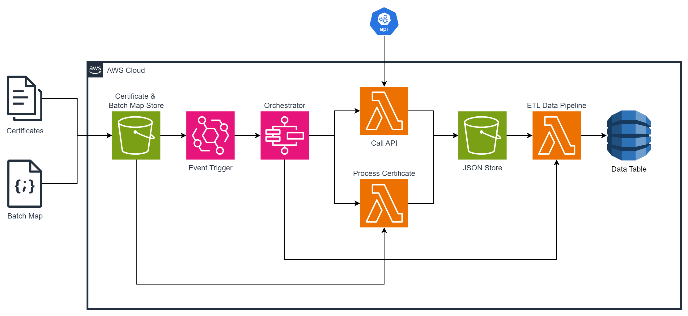
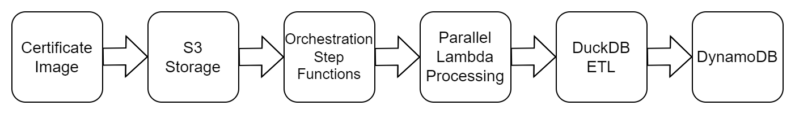

# Udemy Data Pipeline Project
## Overview
Cloud-native data pipeline that extracts Udemy certificate data using OCR,
enriches it via APIs, and transforms it into analytics-ready datasets using a
serverless AWS architecture.

✅ Serverless AWS Architecture  
✅ Medallion ELT Pipeline  
✅ Terraform IaC + CI/CD  

## Table of Contents
1. [Features](#features)
1. [Data Architecture](#data-architecture)
1. [Devops](#devops)
1. [Tech Stack](#tech-stack)
1. [Quick Start](#quick-start)
1. [Result](#result)
1. [Lessons Learned](#lessons-learned)
1. [Areas for Improvement](#areas-for-improvement)
1. [License](#license)

## Features
### Serverless Architecture
Designed for high scalability and cost efficiency. Deployed on AWS:
- AWS Lambda
- AWS Step Functions
- Amazon S3
- Amazon DynamoDB
- Amazon EventBridge
- Amazon ECR

### Real-World Data
- Extracts text from Udemy certificate images
- Retrieves additional metadata via public API

### ETL Data Pipeline
- Medallion architecture implementation
- SQL-based transformations powered by DuckDB
- Configuration-driven and idempotent design

### Infrastructure as Code (IaC)
All infrastructure is provisioned using Terraform, enabling:
- Automated deployments
- Version-controlled infrastructure

### CI/CD Pipeline
Automated build and deployment workflow:
- Lambda functions containerized with Docker
- Images pushed to ECR

## Data Architecture


### Design Principles
- Serverless architecture for high scalability and low cost
- IaC methodology for state management and version control
- CI/CD pipeline
- Deployment on AWS
- Testing DuckDB

###   Data Flow (Simplified)


### Data Ingestion
#### Image Scraping
- Extract text from my Udemy certificate images
- Use Tesseract OCR library for image scraping
- Generate a data object for each certificate
- Store each data object in JSON format in S3

#### API Calling
- Calls external APIs using requests
- Retrieves owned course metadata
- Stores course datasets as JSON in S3

### Orchestration
The pipeline uses Step Functions to orchestrate distributed batch processing.

### ETL Pipeline
The project implements a **Bronze → Silver → Gold** data model.

| Layer      | Purpose                         |
| ---------- | ------------------------------- |
| **Bronze** | Raw JSON ingestion from S3      |
| **Silver** | Cleaned & standardized datasets |
| **Gold**   | Analytics-ready aggregates      |

Transformations are executed using **DuckDB SQL**, enabling fast analytical processing without managing dedicated infrastructure.

Pipeline characteristics:
- Configuration-driven
- Idempotent
- Extensible
- Type-safe

## Devops
### Cloud Deployment
- AWS as cloud provider
- Terraform-managed infrastructure
- Serverless Lambda execution model

Required Terraform providers:
- aws
- docker
- random

### CI/CD Workflow
1. Build Docker image
1. Push the Docker image to Amazon Elastic Container Registry (ECR)
1. Deploy containerized Lambda automatically

## Tech Stack
| Category           | Technology       |
| :----------------- | :--------------- |
| Language           | Python           |
|                    | SQL              |
|                    | Bash             |
| AWS                | AWS SDK (boto3)  |
|                    | Lambda           |
|                    | Step Functions   |
|                    | DynamoDB         |
|                    | ECR              |
|                    | EventBridge      |
|                    | S3               |
| Devops             | Docker Engine    |
|                    | Terraform        |
| Data Processing    | DuckDB           |
|                    | Pandas           |
|                    | Tesseract OCR    |
|                    | pytesseract      |
| Tooling            | UV               |
|                    | Git / GitHub              |
**Table 1:** Technology Stack

## Quick Start
**try in <5 minutes**
### Prerequisites
- Docker Engine/Docker Desktop -> [Installation](https://docs.docker.com/engine/install/)
- Terraform -> [Installation](https://developer.hashicorp.com/terraform/)
- AWS CLI -> [Installation](https://docs.aws.amazon.com/cli/latest/userguide/getting-started-install.html)
### Install
Clone the repository:
```bash
git clone https://github.com/axel-stage/udemy-pipeline
```
Navigate to the project's iac directory:
```bash
cd udemy-pipeline/iac
```
Change the provider setup in iac/providors.tf:
```hcl
provider "aws" {
  region                   = var.region
  profile                  = "default"
  shared_config_files      = ["<add path to your AWS config file>"]
  shared_credentials_files = ["<add path to your AWS credentials file>"]
  ...
  }
}
```
Use Terraform to deploy infrastructure on AWS:
```bash
terraform init
terraform plan
terraform apply
```
### Run
Invoke lambda functions:
```bash
../bin/invoke_lambda_udemy.sh https://www.udemy.com/course/python-3-deep-dive-part-1/
```
```bash
../bin/invoke_lambda_certificate.sh
```
## Result
...

## Lessons Learned
- Installing Tesseract OCR inside Amazon Linux 2023 Lambda containers was challenging. A Ubuntu-based container with awslambdaric provided a stable workaround.
- First usage of uv significantly improved my workflow. I like it.
- DuckDB is a great tool. Easy to learn and works well in Lambda. Can replace pandas.
- Step Functions are hard to learn. Amazon States languages is deeply nested and gets complex very quick. Not sure to use it again.
- Tried web scraping for the project and total underestimated the challenges it comes with
## Areas for Improvement
- Install Tesseract OCR on a amazon linux 2023 container
- Remote Terraform state management (S3 + DynamoDB locking)
- Observability & monitoring with CloudWatch dashboards
## License
This project is licensed under the MIT license.
See [LICENSE](LICENSE) for more information.
